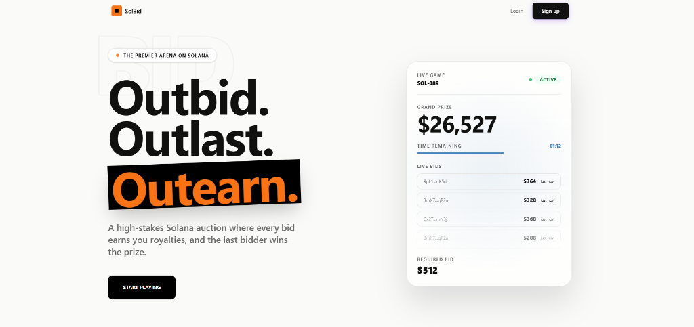

<h3 align="center">A decentralized bidding game on Solana where every bid earns you royalties, and the last bidder wins the prize.</h3>
<p align="center">
  
</p>

## How It Works

1. **Someone creates a game** with an initial bid amount and a countdown timer
2. **You place a bid.** Each new bid must be exactly **2x** the previous one. The timer resets.
3. **If you get outbid**, you earn a passive royalty from the pot. You're not out — you're earning.
4. **If the timer runs out and you're the last bidder**, you take the entire prize pool.

No middlemen. No house edge beyond a small platform fee. The game logic is fully on-chain and verifiable.

## Architecture

The project is split into three independent services:

```
solbid/
├── programs/       ← On-chain program (game logic, bid validation, royalty distribution)
├── next-app/       ← Frontend + API (UI, auth, database, REST endpoints)
└── ws/             ← Real-time server (live bid updates)
```

## Tech Stack

| Layer      | Tech                                |
| ---------- | ----------------------------------- |
| Blockchain | Solana                              |
| Frontend   | Next.js, Tailwind CSS, motion/react |
| Auth       | NextAuth.js                         |
| Database   | PostgreSQL, Prisma                  |
| Real-time  | WebSocket                           |

---

### Setup

```bash
git clone https://github.com/Rahulwagh07/solbid.git
cd solbid

# Install frontend dependencies
cd next-app
pnpm install

# Set up environment variables
# Copy .env.example to .env and fill in your database URL,
# NextAuth secret, and Google OAuth credentials.

# Generate Prisma client
npx prisma generate

# Run the dev server
pnpm run dev
```

For the real-time server:

```bash
cd ws
pnpm install
pnpm run dev
```
